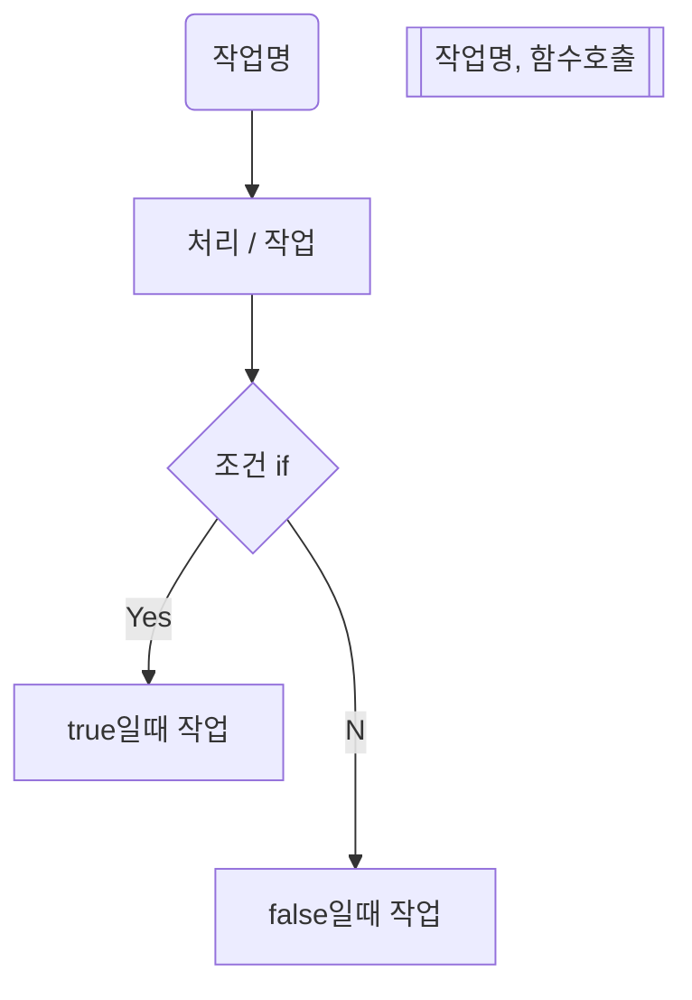

# Algorithm

- 정형화된 알고리즘
  - 피보나치 이런거... 정해져있는거
- 문제를 해결하기 위한 일련의 단계적 절차
- 흐름
- 알고리즘에서 중요시 해야할, 흐름을 만드는데 있어서 중점에 두어야 할것

  - 정확도
  - 시간
  - 메모리효율 (블록체인에선 결국 돈)

- big o
- o1은 몇개를 넣어도 10초가 걸리는
- on은 10개를 넣었을때 100초 100개 는 1000초 이렇게

